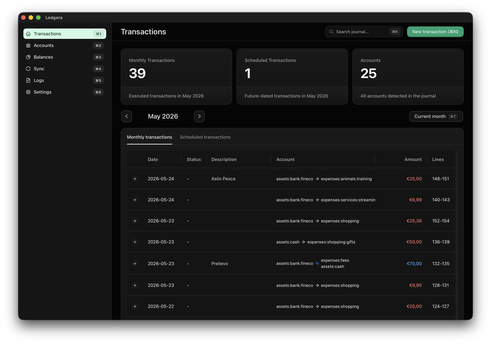

# Ledgera

A desktop app for managing [hledger](https://hledger.org) journals - built with Tauri, React, and Rust.



## Features

- **Browse & filter** - monthly transactions, scheduled entries, accounts overview with time-range filters
- **Edit, create & delete** - full CRUD on journal entries with date, status, code, description, and postings
- **Investment mode** - enter quantity, commodity, and unit price; the balancing cash posting is calculated automatically using hledger's `@` syntax
- **Split journal support** - flat, nested, and glob-based include structures are auto-detected
- **Logs** - structured event log (errors, warnings, mutations), visible for power users, with one-click copy
- **Structured errors** - backend-driven error codes with localised messages and technical details

## Requirements

- Node.js and npm
- Rust toolchain
- [hledger](https://hledger.org/install.html) installed locally or configured in the app settings

## Getting started

```bash
npm install
npm run tauri:dev        # desktop app (dev mode)
npm run dev              # frontend only (browser)
npm run tauri:build      # production build
```

## Settings

Open the **Settings** tab to configure:

| Setting | Description |
|---------|-------------|
| Journal path | Path to your main `.journal` file |
| hledger path | Custom executable path (auto-detected by default) |
| Default commodity | e.g. `EUR`, `€`, `USD` |
| Theme | System / Dark / Light |
| Language | System / English / Italian |
| Power user | Show raw journal entries, line numbers, and the Logs section |

## Translations

Ledgera ships with English and Italian translations. Translation files live in `src/locales/` and use the same nested JSON key structure as `en.json`. To add or update a language:

1. Copy `src/locales/en.json` to a new locale file, for example `fr.json`.
2. Translate all values while keeping keys unchanged.
3. Register the locale in `src/i18n.ts` and `src/utils/language.ts`.
4. Run `npm run typecheck` and `npm run test` before opening a PR.

## CI/CD and releases

GitHub Actions runs the CI pipeline on every push and pull request:

- ESLint
- TypeScript type-checking
- frontend tests with Vitest
- Rust backend tests with Cargo

A manual **Build verification** workflow is available in GitHub Actions to test distributable builds before publishing a release. It builds macOS and Linux packages on native runners and cross-builds the Windows installer and portable zip from Linux using `cargo-xwin`.

Release builds are created only from Git tags matching `v*`. The tag version must match `package.json`:

```bash
git tag v0.1.0
git push origin v0.1.0
```

The release workflow builds and uploads manual download artifacts to GitHub Releases:

- macOS `.app` zip and `.dmg`
- Linux `.deb` and AppImage
- Windows NSIS installer and portable zip, cross-built with `cargo-xwin`

Ledgera does not publish a Tauri updater manifest. Users choose and download the package they want from GitHub Releases. On Windows, the NSIS installer embeds the Microsoft Edge WebView2 offline installer so it can complete without downloading WebView2 during setup. Use the portable zip to run Ledgera without installing shortcuts or system-wide entries; the portable zip requires WebView2 to already be installed on the system.

### macOS unsigned builds

Current macOS artifacts are unsigned and not notarized. macOS Gatekeeper may block them after download. If you trust the artifact source, remove the quarantine attribute before opening the app:

```bash
xattr -dr com.apple.quarantine /Applications/Ledgera.app
open /Applications/Ledgera.app
```

If you run the `.app` directly from another folder, replace `/Applications/Ledgera.app` with the actual app path.

## Sample journals

The `examples/` directory contains ready-to-use journals:

- `examples/sample.journal` - single-file journal with past-month and current-month transactions, including an investment example
- `examples/split-flat/` - month-based split (`include YYYY-MM.journal`) with past-month and current-month files
- `examples/split-glob/` - year/month glob split (`include YYYY/*.journal`) with past-month and current-month files
- `examples/custom-hledger-path/` - custom CLI setup with simple past-month and current-month smoke-test entries

## Project structure

| Directory | Purpose |
|-----------|---------|
| `src/` | React frontend - routes, components, i18n |
| `src-tauri/` | Rust backend - journal parsing, mutation, logging |
| `examples/` | Sample hledger journal layouts |
| `screenshots/` | Screenshots |
